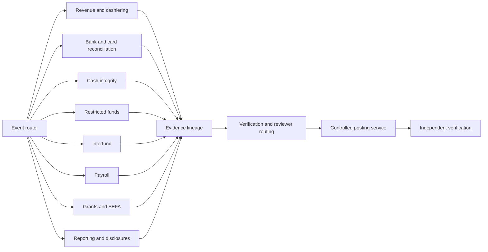

# Specialist-agent map

Agents have bounded responsibilities. They can identify exceptions, assemble evidence, and propose treatment. They cannot manufacture authority, approve their own work, or bypass controlled posting and verification gates.

