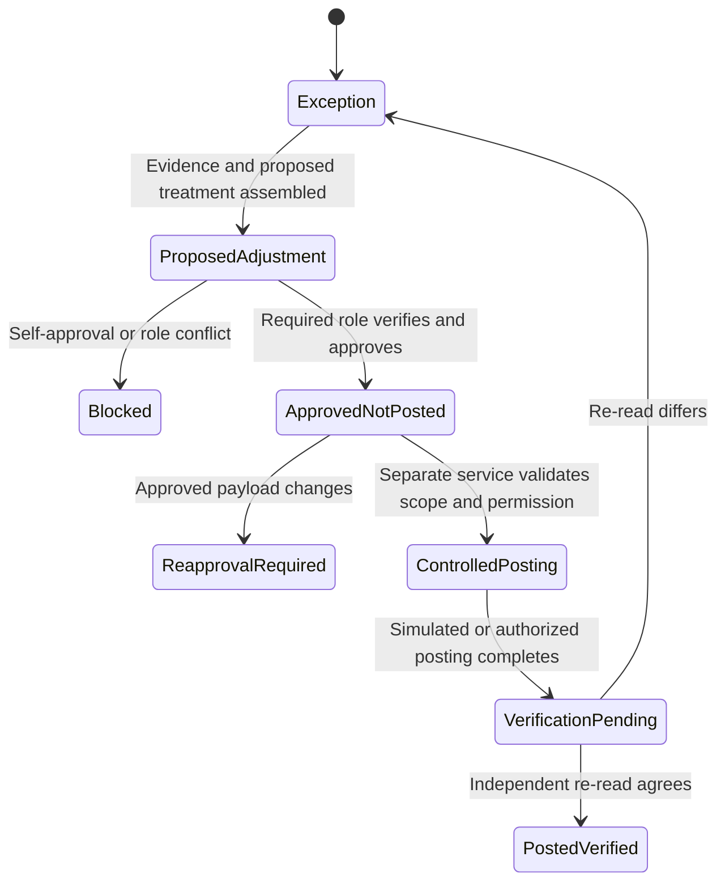

# Approval and posting flow

## Required separation

- The preparer cannot approve its own work.
- System access does not create approval authority.
- Approval is scoped to the event and approved payload.
- Approval does not equal posting.
- Posting does not equal completion until independently verified.

