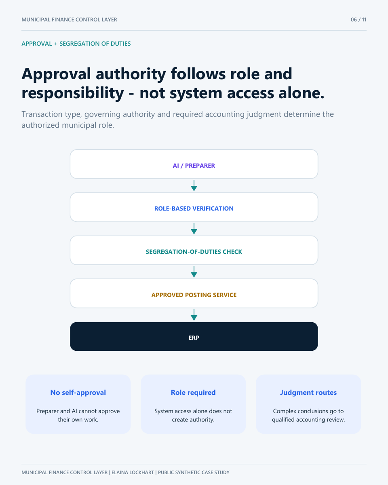

# Approval and posting flow

`EXCEPTION`  
↓ Evidence and proposed treatment assembled  
`PROPOSED_ADJUSTMENT`  
↓ Required role verifies; segregation-of-duties control passes  
`APPROVED_NOT_POSTED`  
↓ Separate service validates scope and permission  
`CONTROLLED_POSTING`  
↓ Independent re-read agrees  
`POSTED_VERIFIED`

Self-approval or a role conflict is blocked. A changed approved payload requires new approval. A failed independent re-read returns the item to exception status.

## Required separation

- The preparer cannot approve its own work.
- System access does not create approval authority.
- Approval is scoped to the event and approved payload.
- Approval does not equal posting.
- Posting does not equal completion until independently verified.
