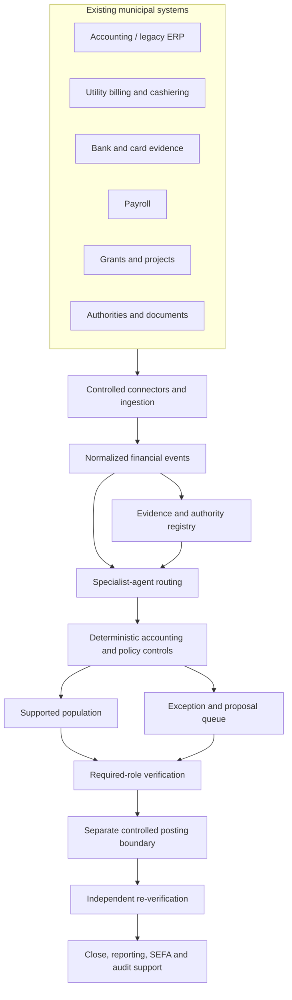

# Data flow

## Design principles

1. Existing systems remain authoritative.
2. Enrichment is additive; source facts are not silently overwritten.
3. Economic Event IDs connect transactions to evidence and approvals.
4. Accounting analysis, approval, posting, and verification are distinct states.
5. Unresolved evidence remains an exception rather than becoming an assumed conclusion.

