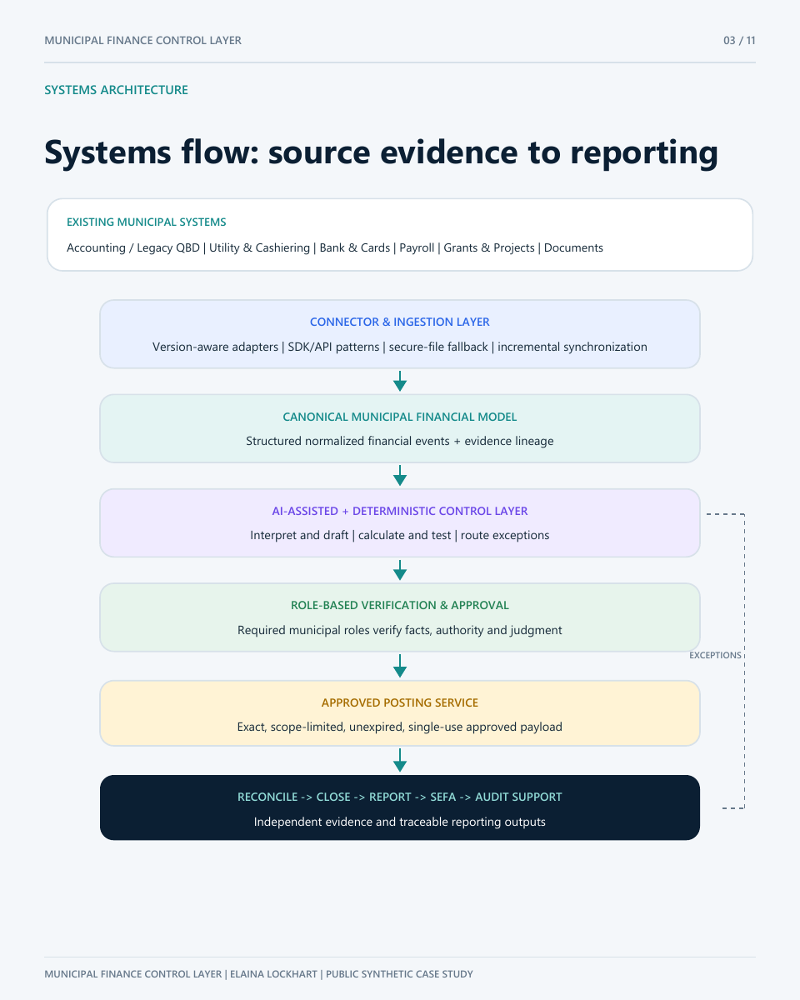
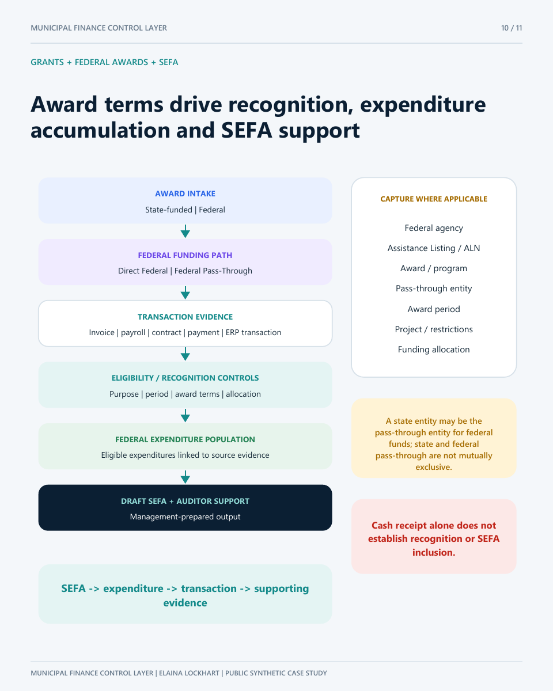

# Pinehaven synthetic demonstration

The interactive public demo is the repository's root [`index.html`](../index.html). When GitHub Pages is enabled, the repository's Pages URL opens that demo directly.

The fictional City of Pinehaven example demonstrates visible control outcomes without publishing proprietary implementation logic or private municipal data.

## Selected public views

### Systems architecture

### Role-based approval and segregation of duties

### Grants, federal awards, and SEFA

## Interactive modules

- Incremental ERP pull with duplicate-delivery suppression and a source watermark
- Mixed cashier batch routing with restricted-fund correction and authorized dry run
- Payroll allocation change from 60%/40% to 70%/30%, with verification required before calculation
- Visible authorization usage counters plus self-approval, reuse, and changed-payload rejection
- Role conflict and self-approval blocking
- Required-role approval and approval-versus-posting separation
- Exact, timing, fee, exception, and card-settlement bank dispositions
- Restricted-purpose pass and hold
- Reciprocal interfund settlement
- Evidence-linked synthetic draft SEFA
- Economic Event ID evidence package
- Department, disclosure, compliance, intake, knowledge, technical-review, and reporting simulations
